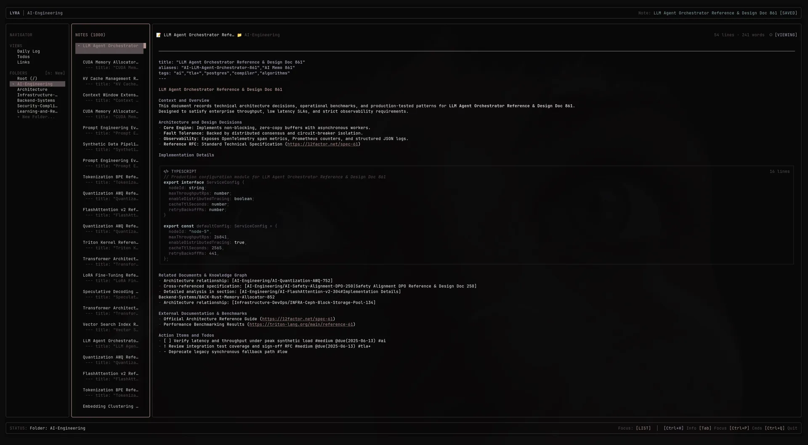
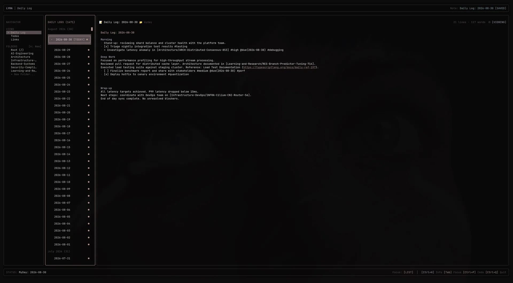
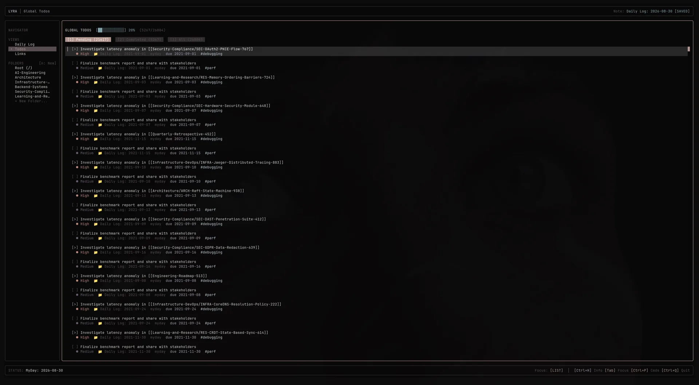
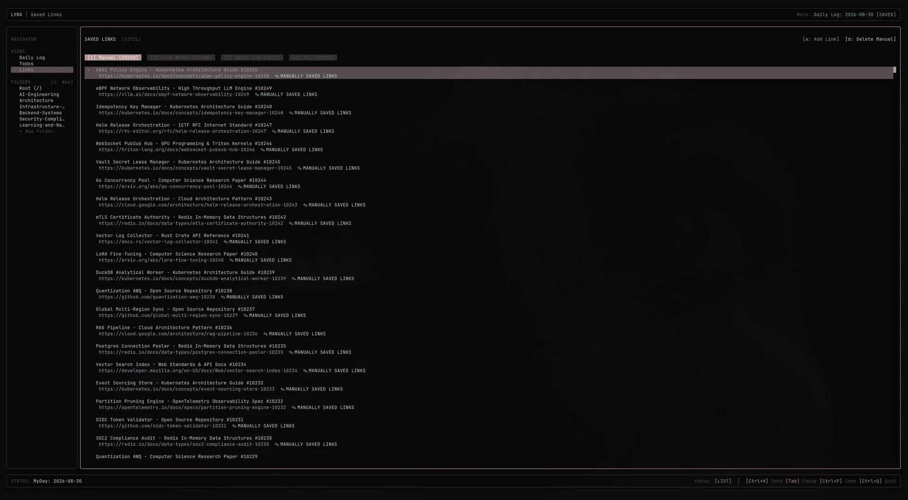
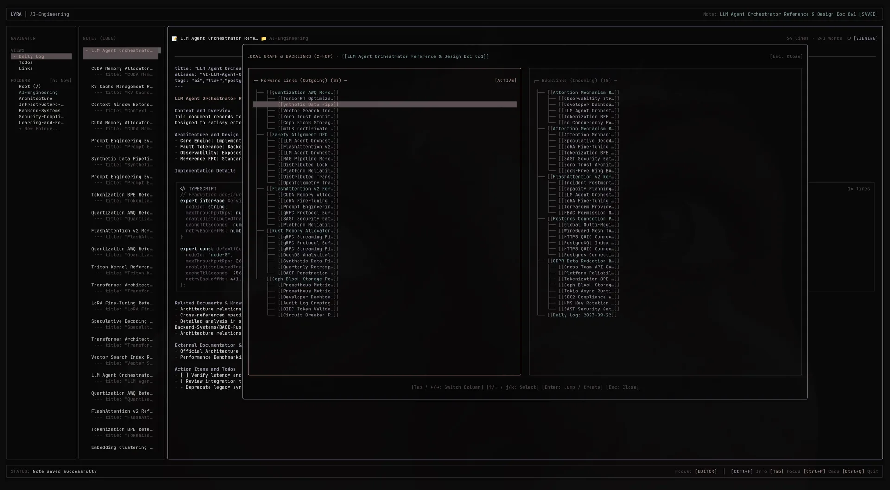

# LYRA TUI

**Lyra TUI** is a local-first developer workspace for Markdown notes, daily logs, tasks, bookmarks, and a lightweight knowledge graph, built for the terminal.

It keeps the source of truth in ordinary files while providing a focused TUI, an automation-friendly CLI, keyboard-first navigation, and optional Git synchronization.

<div align="center">
  
</div>

---

> [!WARNING]
> **Project Status: Beta / Hobby Project**
> Lyra TUI is a hobby project maintained in spare time. Features and APIs may evolve rapidly. Bug reports, feature suggestions, and contributions are welcome.

## The Developer Workflow

```text
Daily Log -> Todo -> Note or Memo -> Link -> Git history
```

1. Capture the plan, meeting, or observation in today's Daily Log.
2. Turn concrete next actions into Markdown todos.
3. Move durable context into a named note or themed folder.
4. Save useful external references as bookmarks or Markdown links.
5. Review and synchronize the vault when the work is ready.

## Features

### Markdown Notes

- Plain `.md` files with no proprietary database or lock-in.
- Notes can live in the vault root or in top-level folders.
- Markdown editing with syntax highlighting and preview.
- Attach files to notes (`Ctrl+O`): files are copied into `attachments/` (Obsidian-compatible) and can be opened with the default system app from the editor's viewing mode (`a`).
- External editor support through `VISUAL` or `EDITOR`.

### Daily Logs

- Dated files in `myday/YYYY-MM-DD.md` for plans, stand-ups, meetings, and reflections.
- Daily logs can contain ordinary Markdown todos and external links.
- Browse historical logs from the My Day view.

<div align="center">
  
</div>

### Todos

- Vault-wide task aggregation across notes and Daily Logs.
- Multiple states: open, in progress, urgent, question, paused, and completed.
- Priorities, due dates, tags, source locations, and interactive status changes.

<div align="center">
  
</div>

### Links And Bookmarks

- Manual bookmarks stored in the vault and web links extracted from Markdown.
- Titles, descriptions, tags, source notes, and JSON output for automation.
- Open links directly in the default browser from the TUI.

<div align="center">
  
</div>

### Wikilinks And Knowledge Graph

- Wikilinks with aliases, heading anchors, and transclusion edges in the knowledge graph; transclusions are indexed as edges but are not rendered inline by the editor.
- Backlinks, forward links, local neighborhoods, unresolved links, and orphan detection.
- Mermaid, Graphviz, and JSON graph export.

<div align="center">
  
</div>

### Git-Backed Vault

- Note, task, folder, and bookmark changes can be committed with meaningful messages when the vault is a Git repository.
- Pull, push, full synchronization, and an optional foreground sync scheduler.
- During Git initialization Lyra adds generated `.lyra/` data to `.gitignore`, and saving configuration adds `.env`. If `.env` was already tracked (for example in a pre-existing vault repository), Lyra automatically removes it from the index on the next commit and keeps the file on disk.

### Optional AI

AI is an optional enhancement for local semantic search, editor assistance, and bookmark autofill. Lyra supports local embeddings and multiple providers, but the core Markdown, Daily Log, todo, link, and graph workflow works without AI.

### Secrets And Keychain

- API keys and provider settings marked as secrets are stored in `.env` inside the vault, which Lyra always keeps out of Git.
- Optionally, run **Toggle Keychain Storage** in the command palette to store secrets in the operating system keychain instead: macOS Keychain, the freedesktop Secret Service (GNOME Keyring, KDE Wallet) on Linux, or the Windows Password Vault. Enabling it moves existing secrets out of `.env` automatically; if a keychain write fails, the value falls back to `.env` so nothing is lost.
- If you ever pushed your vault before `.env` was excluded, or committed secrets manually, those keys remain in the remote Git history: **rotate them**.

## Installation

Download and install the self-contained executable for Linux or macOS:

```bash
curl -fsSL https://raw.githubusercontent.com/ILDaviz/lyra-tui/main/install.sh | bash
```

For local development from this repository:

```bash
LYRA_REPO_PATH="$PWD/lyra_dev" bun run packages/tui/bin/lyra-tui.ts
```

The production default vault is `~/.lyra`; development uses `~/.lyra_dev` and tests use `~/.lyra_test`. Set `LYRA_REPO_PATH` to use another vault.

## Quick Start

```bash
# Launch the interactive TUI
lyra

# Inspect the vault
lyra status

# Add a task to today's Daily Log
lyra todo add "Review the quarterly roadmap" --today -p high

# Add a bookmark
lyra links add "https://bun.sh" "Bun Runtime" -d "Fast JavaScript runtime"

# View today's Daily Log
lyra today show

# Inspect the knowledge graph
lyra graph stats
```

## CLI Examples

Lyra provides human-readable output by default and JSON output for scripts.

```bash
# Notes
lyra note list
lyra note list "Engineering"
lyra note show "Engineering/Debugging-Playbook.md"

# Daily Logs
lyra today show
lyra today append "Discussed deployment strategy with the team"

# Todos
lyra todo list
lyra todo list --all --json
lyra todo list --status in_progress
lyra todo list --folder Engineering --all

# Links
lyra links list --filter manual
lyra links list --notes --json

# Graph
lyra graph backlinks "Architecture Decision Records"
lyra graph export vault-graph.mmd

# Git synchronization
lyra sync --dry-run
lyra sync
```

Use `--no-color` or `NO_COLOR=1` when piping CLI output to another program. Mutating commands support `--dry-run` where applicable.

## Documentation Skills

The operational documentation is available as reusable Markdown skills folders for both humans and AI agents.

## Themes And Languages

Change the theme or language from the Command Palette with `Ctrl+P`.

- Themes: Dark, Light, Dracula, Nord, Catppuccin, Tokyo Night, and Monokai. Omarchy System is available on supported Omarchy environments.
- Languages: English (`en`) and Italian (`it`).

> [!NOTE]
> **Known Limitations**
> - **Platforms:** Linux and macOS, with a true-color terminal.
> - **Vault scale:** developed and tested on ~10k-note vaults; comfortable up to ~30–50k notes. Startup stays fast at any size (data loads in the background), but scans and caches grow linearly with vault size.
> - **AI storage:** with optional AI enabled, `.lyra/embeddings.json` grows by roughly 25 KB per note; the local embedding model is downloaded on first use and cached in `.lyra/models`.
> - **Caches:** `.lyra/scan-cache.json` and `.lyra/embeddings.json` are plain JSON files and can be safely deleted — they are rebuilt automatically.

## License

Released under the MIT License.
